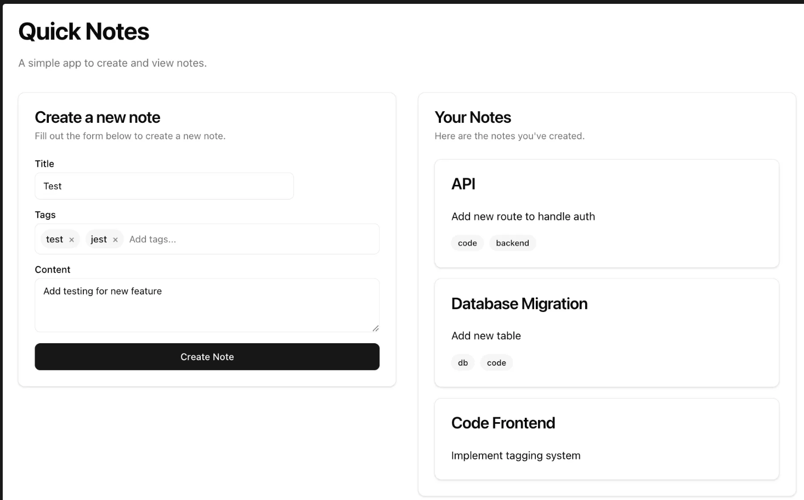

# Quick Notes

Quick Notes is a simple note-taking application built with Next.js. It allows users to create and view their notes seamlessly.

## Features

- **Create Notes:** Quickly add new notes with a title and content.
- **View Notes:** See all your notes at a glance.
- **Simple Interface:** A clean and intuitive user interface.

## Getting Started

To get the application running locally, follow these steps:

1.  **Clone the repository:**
    ```bash
    git clone https://github.com/your-username/quick-notes.git
    cd quick-notes
    ```

2.  **Install dependencies:**
    Using your preferred package manager:
    ```bash
    npm install
    ```
3.  **Create a .env file:**
    ```bash
    cp .env.example .env
    ```
    Complete the .env file with the database credentials from docker-compose.yml

4.  **Run the database:**
    This project uses Docker to run a PostgreSQL database. Make sure you have Docker installed and running.
    ```bash
    docker-compose up -d
    ```

4.  **Apply database migrations:**
    This project uses Prisma for database management. Apply the migrations to set up the database schema.
    ```bash
    npx prisma migrate dev
    ```

5.  **Run the development server:**
    ```bash
    npm run dev
    ```

Open [http://localhost:3000](http://localhost:3000) with your browser to see the result.

## Live Coding Challenge: Adding Tags to Notes

This exercise is designed to test your full-stack development skills. You will extend the existing "Quick Notes" application by adding a tagging system. The total time for this exercise is 2 hours.

### Your Tasks:

**1. Enhance the Database Schema**

- **Task**: Create a new `Tag` table and establish a many-to-many relationship with the `Note` table.
- **File to modify**: `prisma/schema.prisma`

**2. Migrate the Database**

- **Task**: Generate and apply a new database migration.
- **Tool to use**: `npx prisma migrate dev`

**3. Update Backend Actions**

- **Task**: Modify the `createNote` server action to handle creating and associating tags with notes. This includes adding validation for the new tag data. 
    - If the tag already exists, we should not create a new tag, we should just associate the existing tag with the note.
    - If the tag does not exist, we should create a new tag and associate it with the note.

- **File to modify**: `lib/actions.ts`

**4. Create a `TagInput` Component**

- **Task**: Build a reusable React component for adding tags in the note creation form. The user can type a tag and press enter to update the local state of the tags. After adding all desired tags, the user can click a button to submit the title, content, and tags for the note to the server.
- **File to create**: `components/ui/tag-input.tsx` (or similar)

**5. Integrate the New Functionality**

- **Task**: Integrate the `TagInput` component into the `CreateNoteForm`, update the submission logic, and display the tags for each note in the `Notes` list.
- **Files to modify**: `components/create-note-form.tsx`, `components/notes.tsx`.

**Desired outcome:**


This challenge will test your ability to work with a database, handle backend logic, build React components, and integrate everything into a cohesive feature. Good luck!

